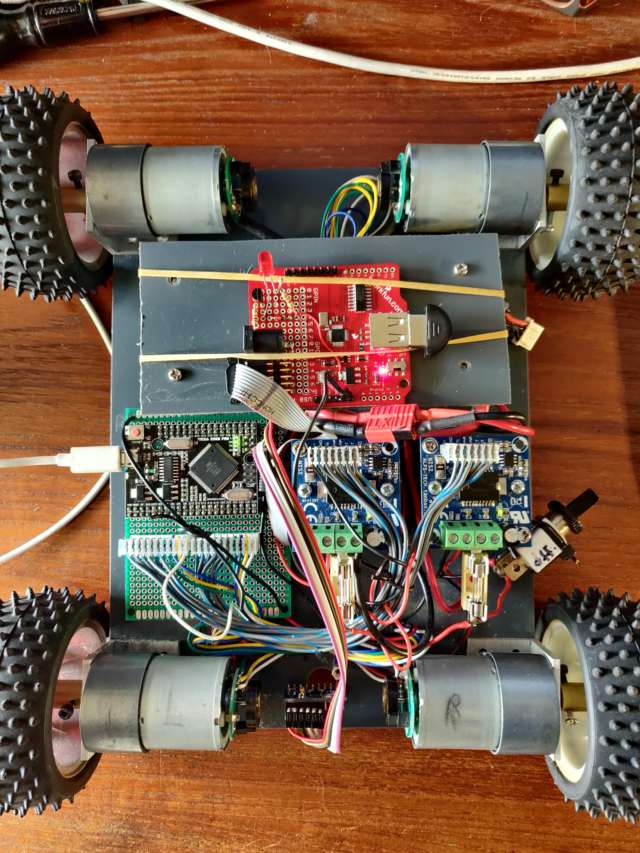
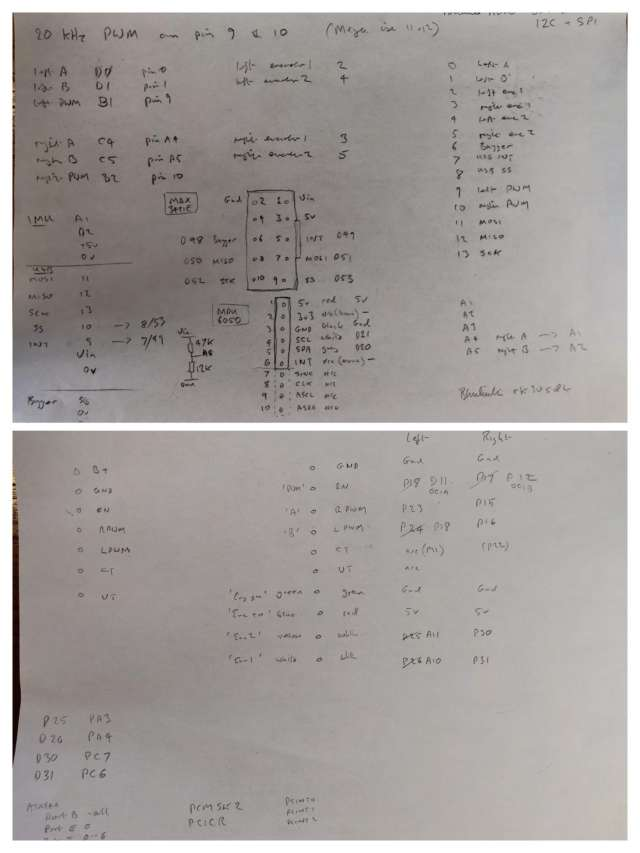

# Balanduino

cloned from https://github.com/TKJElectronics/Balanduino

Rework for mega2560 dev board

https://unix.stackexchange.com/questions/128531/rfcomm-device-seems-to-be-missing-dev-rfcomm0

https://forum.arduino.cc/t/how-to-enable-the-interrupts-on-pins-d4-d12-a0-a5-on-arduino-mega-2560-board/182961

https://www.st.com/en/motor-drivers/l6201.html

https://electronics.stackexchange.com/questions/31500/motor-driver-board-wingxine-need-help-with-wiring

http://www.trainelectronics.com/DCC_Arduino/DCC++/index.htm

